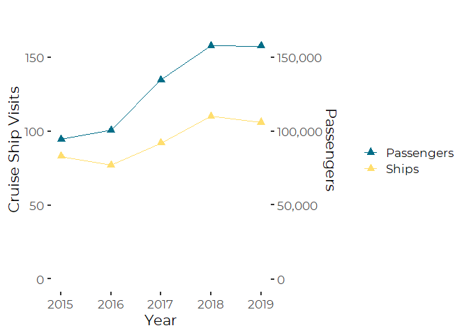
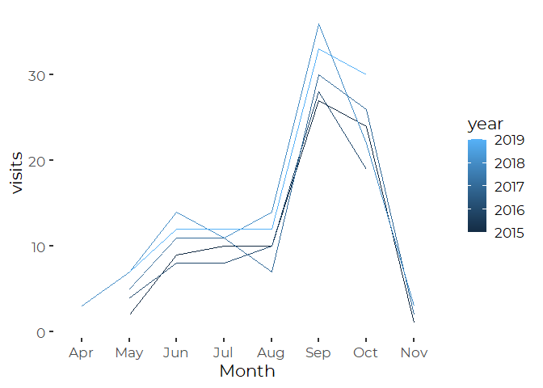
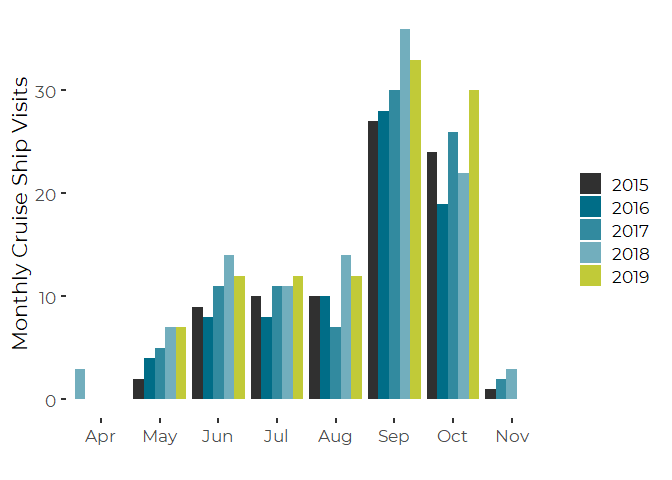
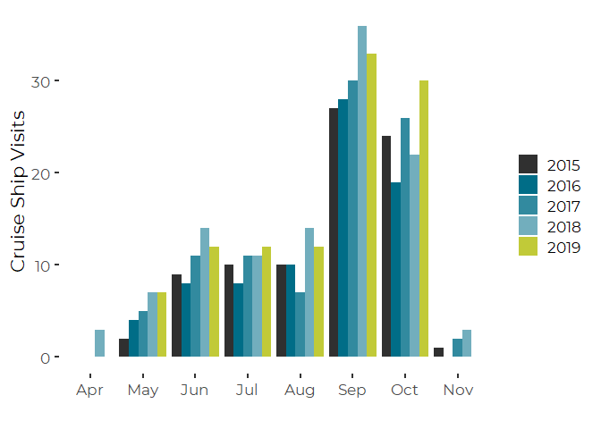
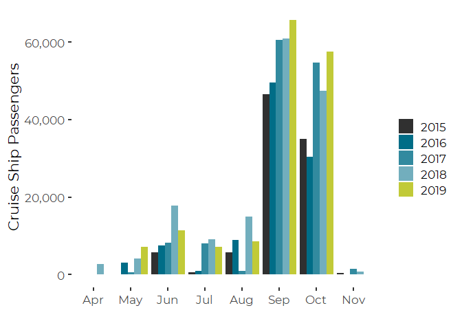

Portland Cruise Ship Visits 2015-2019
================
Curtis C. Bohlen, Casco Bay Estuary Partnership
7/16/2020

  - [Load Data](#load-data)
      - [Establish Folder Reference](#establish-folder-reference)
      - [Load Excel Data](#load-excel-data)
  - [Strategy](#strategy)
  - [Annual Totals](#annual-totals)
      - [Table](#table)
  - [Graphics for Visits and
    Passengers](#graphics-for-visits-and-passengers)
  - [Graphics for Ship Size](#graphics-for-ship-size)
  - [Seasonal Patterns](#seasonal-patterns)


``` r
library(tidyverse)
```

    ## -- Attaching packages ------------------------------------------------------------------------------------------------------------------------------------------------------------- tidyverse 1.3.0 --

    ## v ggplot2 3.3.2     v purrr   0.3.4
    ## v tibble  3.0.1     v dplyr   1.0.0
    ## v tidyr   1.1.0     v stringr 1.4.0
    ## v readr   1.3.1     v forcats 0.5.0

    ## -- Conflicts ---------------------------------------------------------------------------------------------------------------------------------------------------------------- tidyverse_conflicts() --
    ## x dplyr::filter() masks stats::filter()
    ## x dplyr::lag()    masks stats::lag()

``` r
library(readxl)

library(CBEPgraphics)
load_cbep_fonts()
```

# Load Data

## Establish Folder Reference

``` r
sibfldnm <- 'Derived_Data'
parent   <- dirname(getwd())
sibling  <- file.path(parent,sibfldnm)
```

## Load Excel Data

``` r
fn    <- 'Portland Cruise Ships Data.xlsx'
fpath <- file.path(sibling,fn)

the_data <- read_excel(fpath,
                       sheet = "Cruise", 
                      col_types = c("skip", "text", "date", 
                            "date", "date", "date", "text", "text", 
                            "text", "skip", "text", "skip", "text", 
                            "skip", "skip", "numeric", "numeric", 
                            "numeric", "numeric", "numeric", "skip")) %>%
  rename_all(~tolower(.)) %>%
  rename(vessel   = `vessel name`) %>%
  mutate(arr_date = as.Date(arr_date),
         dep_date = as.Date(dep_date)) %>%
  mutate(arr_time = as.numeric(format(arr_time, format = '%H')),
         arr_time = as.numeric(format(arr_time, format = '%H'))) %>%
  mutate(year     = as.numeric(format(arr_date, format = '%Y')),
         Month    = factor(as.numeric(format(arr_date, format = '%m')), levels = 1:12, labels = month.abb),
         doy      = as.numeric(format(arr_date, format = '%j')))

vessel_data <- read_excel(fpath, 
    sheet = "Vessels Pivot Table", col_types = c("text", 
        "numeric", "numeric", "numeric", 
        "numeric")) %>%
  rename(LOA = `Min of LOA`,
         BEAM = `Min of B`,
         DRAUGHT = `Min of D`,
         VISITS = `Count of ARR_DATE`)  %>%
  rename_all(~tolower(.))

nms <- names(vessel_data)
nms[1] <- 'vessel'
names(vessel_data) <- nms

ferry_data <-  read_excel(fpath, 
                          sheet = "Ferry", col_types = c("text", 
                              "date", "date", "date", "date", "text", 
                              "text", "text", "skip", "text")) %>%
  rename_all(~tolower(.)) %>%
  rename(vessel   = `vessel name`) %>%
  mutate(arr_date = as.Date(arr_date),
         dep_date = as.Date(dep_date)) %>%
  mutate(arr_time = as.numeric(format(arr_time, format = '%H')),
         arr_time = as.numeric(format(arr_time, format = '%H'))) %>%
  mutate(year     = as.numeric(format(arr_date, format = '%Y')),
         Month    = factor(as.numeric(format(arr_date, format = '%m')), levels = 1:12, labels = month.abb),
         doy      = as.numeric(format(arr_date, format = '%j')))
```

# Strategy

We want to be able to look at how visits to Portland are changing, so we
want:

  - Annual total number of visits
  - Annual total number of passengers
  - Annual size distribution of ships – both length and passengers
  - Annual pattern of monthly arrivals – ships
  - Annual pattern of monthly arrivals – passengers.

It would be nice to look at crew numbers too, but that data is
incomplete, especially for 2017.

Other interesting questions: When do ships arrive and depart? How long
do they spend in Port?

# Annual Totals

``` r
annual_data <- the_data %>%
  select(-c(2:10)) %>%
  group_by(year) %>%
  summarize( visits       = sum(! is.na(vessel)),
             passengers   = sum(pax, na.rm = TRUE),
             meanpax      = mean(pax, na.rm=TRUE),
             medianpax    = median(pax, na.rm= TRUE),
             meanship     = mean(loa, na.rm=TRUE),
             medianship   = median(loa, na.rm=TRUE))
```

    ## `summarise()` ungrouping output (override with `.groups` argument)

## Table

``` r
knitr::kable(annual_data,
             col.names = c('Year', 'Visits', 'Passengers', 'Mean Passenger #', 'Mean Ship Length (ft)', 'Median Passenger #', 'Median Ship Length (ft)'),
             digits = c(0, 0, 0, 1, 1, 0, 0))
```

| Year | Visits | Passengers | Mean Passenger \# | Mean Ship Length (ft) | Median Passenger \# | Median Ship Length (ft) |
| ---: | -----: | ---------: | ----------------: | --------------------: | ------------------: | ----------------------: |
| 2015 |     83 |      94408 |            1137.4 |                   468 |                 595 |                     610 |
| 2016 |     77 |     100546 |            1305.8 |                   913 |                 624 |                     715 |
| 2017 |     92 |     134643 |            1463.5 |                  1225 |                 638 |                     820 |
| 2018 |    110 |     157853 |            1448.2 |                   795 |                 641 |                     663 |
| 2019 |    106 |     157589 |            1486.7 |                  1805 |                 665 |                     856 |

# Graphics for Visits and Passengers

``` r
annual_data %>% 
  select(! contains('me')) %>%   # drop means and medians, which we don't want here.
  mutate(passengers = passengers/1000) %>%
  pivot_longer(-year, names_to = 'Metric', values_to = 'value') %>%

ggplot(aes(year, value, color=Metric)) + geom_line() + geom_point (shape = 17, size = 3) +
  scale_y_continuous(name = 'Cruise Ship Visits',
                     limits = c(0,175),
                     sec.axis = sec_axis(~ .*1000, name = 'Passengers',
                                         #labels = scales::unit_format(unit = 'Thousand', scale  = 1e-3))) +
                                         labels = scales::comma)) +
  scale_color_manual(values = cbep_colors(), labels = c('Passengers', 'Ships'),
                     name = '') +
  xlab('Year') +
  theme_cbep()
```

<!-- -->

``` r
ggsave('annualvisits.pdf', device = cairo_pdf, width = 7, height = 5)
ggsave('annualvisits.png', type = 'cairo',   width = 7, height = 5)
```

# Graphics for Ship Size

``` r
annual_data %>% 
  select(year, contains('median')) %>%   # retain medians
  pivot_longer(-year, names_to = 'Metric', values_to = 'value') %>%

ggplot(aes(year, value, color=Metric)) + geom_line() + geom_point (shape = 17, size = 3) +
  ylab ("Median Size of Cruise Ships") + 
  ylim(c(0,2000)) +
  scale_color_manual(values = cbep_colors(), labels = c('Passemgers', 'Ship Length')) +
  xlab('Year') +
  theme_cbep()
```

<!-- -->

``` r
#ggsave('shipsizes.pdf', device = cairo_pdf, width = 7, height = 5)
#ggsave('shipsizes.png', type = 'cairo',   width = 7, height = 5)
```

``` r
the_data %>% 
  select(arr_date, loa, pax) %>%

ggplot(aes(loa, pax))+
  geom_hex(aes(fill=stat(log2(count))), bins=15) +

  geom_smooth(se = FALSE, color='yellow') + 
  theme_cbep() +
  
  xlab('Ship Length') +
  ylab('Number of Passengers')
```

    ## Warning: Removed 1 rows containing non-finite values (stat_binhex).

    ## `geom_smooth()` using method = 'loess' and formula 'y ~ x'

    ## Warning: Removed 1 rows containing non-finite values (stat_smooth).

<!-- -->
So, the two strongest clusters are for ships under 350 feet, with
typically under 500 passengers, and over 900 feet with over about 1500

Lets look at a cross tab to roughly optimize classifications.

``` r
loacat = cut(the_data$loa, breaks = c(0, 350, 900, 5000), labels = c("Small", "Medium", "Large"))
paxcat = cut(the_data$pax, breaks = c(0, 500, 1500, 5000), labels = c("Small", "Medium", "Large"))

table(loacat, paxcat)
```

    ##         paxcat
    ## loacat   Small Medium Large
    ##   Small    178      0     0
    ##   Medium    28     33    26
    ##   Large      0      0   195

We can refine the categories slightly to reduce cross-classification
errors.

``` r
loacat = cut(the_data$loa, breaks = c(0, 500, 800, 5000), labels = c("Small", "Medium", "Large"))
paxcat = cut(the_data$pax, breaks = c(0, 500, 1500, 5000), labels = c("Small", "Medium", "Large"))

table(loacat, paxcat)
```

    ##         paxcat
    ## loacat   Small Medium Large
    ##   Small    185      0     0
    ##   Medium    21     30     3
    ##   Large      0      3   218

What we see are the Silver Line ships are longer for the number of
passengers than most….

``` r
the_data %>% mutate(category = loacat) %>%

ggplot(aes(year, ..count.., fill = category) ) + geom_bar() +
  scale_fill_manual (values = cbep_colors2()[4:2],
                     labels = c('Small (< 500 ft)', 'Medium', 'Large (> 800 ft)'),
                     name = '') +
  theme_cbep() +
  ylab ("Number of Vessels") +
  xlab("Year") +
  ylim(0,120)
```

<!-- -->

``` r
ggsave('visitsbysize.pdf', device = cairo_pdf, width = 7, height = 5)
ggsave('visitbysize.png', type = 'cairo',   width = 7, height = 5)
```

# Seasonal Patterns

``` r
monthly_data <- the_data %>%
  select(-c(2:10)) %>%
  group_by(year, Month) %>%
  summarize( visits       = sum(! is.na(vessel)),
             passengers   = sum(pax, na.rm = TRUE),
             meanpax      = mean(pax, na.rm=TRUE),
             medianpax    = median(pax, na.rm= TRUE),
             meanship     = mean(loa, na.rm=TRUE),
             medianship   = median(loa, na.rm=TRUE))
```

    ## `summarise()` regrouping output by 'year' (override with `.groups` argument)

``` r
ggplot(monthly_data, aes(Month,visits, group=year)) + geom_line(aes(color=year)) +theme_cbep()
```

<!-- -->

``` r
ggplot(monthly_data, aes(Month,visits, group=year)) + geom_col(aes(fill=factor(year)), position=position_dodge(preserve='single')) +
  ylab('Monthly Cruise Ship Visits') +
  xlab('') +
  scale_fill_manual(values = cbep_colors2(), name = '') +
  theme_cbep()
```

<!-- -->

We are very close, but we need to fill in missing values to get this to
plot the way we want.

``` r
table(monthly_data$year,monthly_data$Month)
```

    ##       
    ##        Jan Feb Mar Apr May Jun Jul Aug Sep Oct Nov Dec
    ##   2015   0   0   0   0   1   1   1   1   1   1   1   0
    ##   2016   0   0   0   0   1   1   1   1   1   1   0   0
    ##   2017   0   0   0   0   1   1   1   1   1   1   1   0
    ##   2018   0   0   0   1   1   1   1   1   1   1   1   0
    ##   2019   0   0   0   0   1   1   1   1   1   1   0   0

So, we need to add rows for April November from the missing years.}

``` r
add_dat <- tibble(year = c(2015, 2016, 2017, 2019, 2016, 2017),
                  Month = factor (c(4,4,4,4,11,11), levels = 1:12, labels = month.abb),
                  visits=0,passengers=0, meanpax=0, medianpax=0, meanship=0, medianship = 0)
monthly_data2 <- monthly_data %>%
  bind_rows(add_dat)
```

``` r
ggplot(monthly_data2, aes(Month,visits, group=year)) +
  geom_col(aes(fill=factor(year)),
           position=position_dodge(preserve = 'single')) +
  ylab('Cruise Ship Visits') +
  xlab('') +
  scale_fill_manual(values = cbep_colors2(), name = '') +
  theme_cbep()
```

<!-- -->

``` r
ggsave('visitsbymonth.pdf', device = cairo_pdf, width = 7, height = 5)
ggsave('visitbymonth.png', type = 'cairo',   width = 7, height = 5)
```

``` r
ggplot(monthly_data2, aes(Month, passengers, group=year)) +
  geom_col(aes(fill=factor(year)),
           position=position_dodge(preserve = 'single')) +
  ylab('Cruise Ship Passengers') +
  xlab('') +
  scale_fill_manual(values = cbep_colors2(), name = '') +
  scale_y_continuous(labels = scales::comma) +
  theme_cbep()
```

<!-- -->

``` r
ggsave('passengerssbymonth.pdf', device = cairo_pdf, width = 7, height = 5)
ggsave('passengersbymonth.png', type = 'cairo',   width = 7, height = 5)
```
